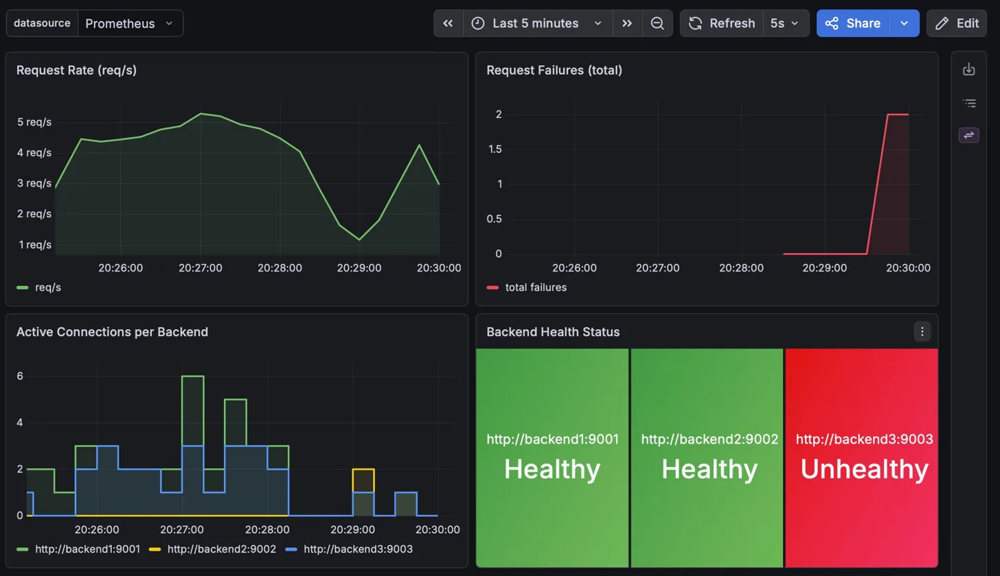

An HTTP reverse proxy and layer-7 load balancer written in Go.



## Features

- **Three routing strategies**:
  - `RoundRobin` — cycles through backends in order
  - `LeastConnections` — routes to the backend with the fewest active connections
  - `ConsistentHash` — routes a given client IP to the same backend via a virtual-node hash ring
- **Active health checks** — each backend is polled every 5 seconds; unhealthy backends are skipped automatically
- **Graceful shutdown** — on `SIGTERM`/`SIGINT`, drains in-flight requests before exiting
- **Hop-by-hop header stripping** and `X-Forwarded-For` forwarding
- **OpenTelemetry metrics** exported in Prometheus format at `/metrics`

## Running locally

```bash
go run .
# defaults to three backends on localhost:9001-9003
```

Pass backend URLs as positional arguments to override:

```bash
go run . http://host1:9001 http://host2:9002
```

## Running with Docker

```bash
docker compose up --build
```

Starts the load balancer on `:8080` and three backend instances on ports 9001–9003. Prometheus and Grafana are also started for observability.

## Observability

The load balancer exposes an OpenTelemetry metrics endpoint at `http://localhost:8080/metrics` in Prometheus format.

| Metric | Type | Description |
|---|---|---|
| `total_requests` | Counter | Total requests received by the load balancer |
| `total_failed_requests` | Counter | Requests that failed to forward or encountered a copy error |
| `request_duration` | Histogram | Execution time of non-failed requests |

When running with Docker Compose:

| Service | URL |
|---|---|
| Load balancer | `http://localhost:8080` |
| Prometheus | `http://localhost:9090` |
| Grafana | `http://localhost:3000` (admin / admin) |

In Grafana, you'll need to add Prometheus data source pointing at `http://prometheus:9090` to see dashboards.
